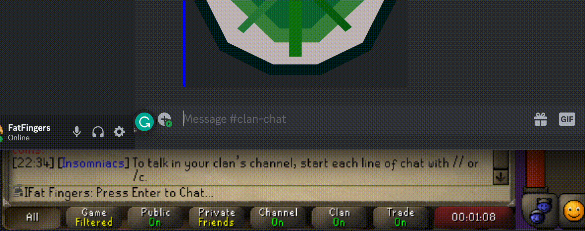
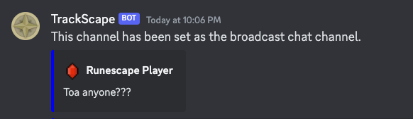
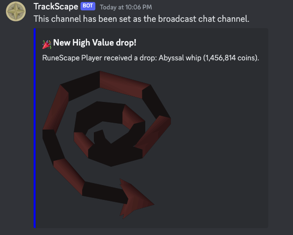
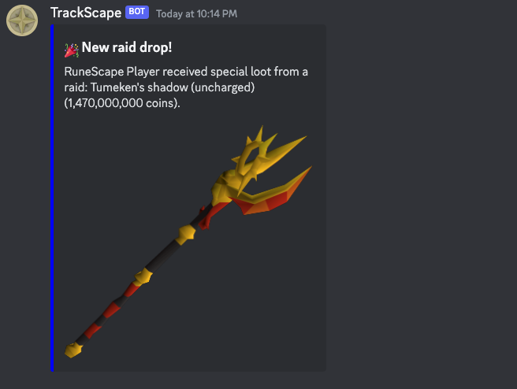
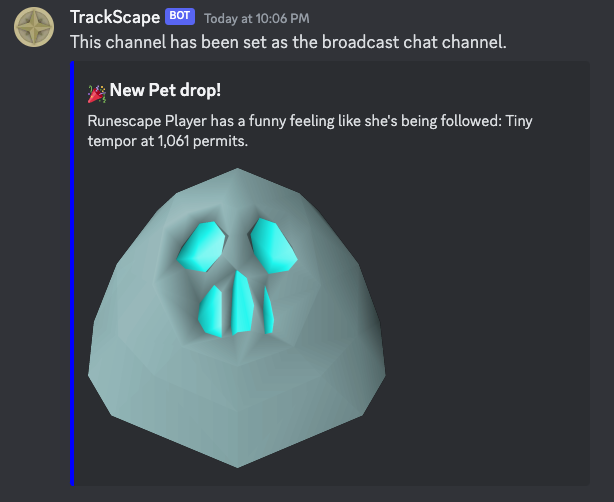
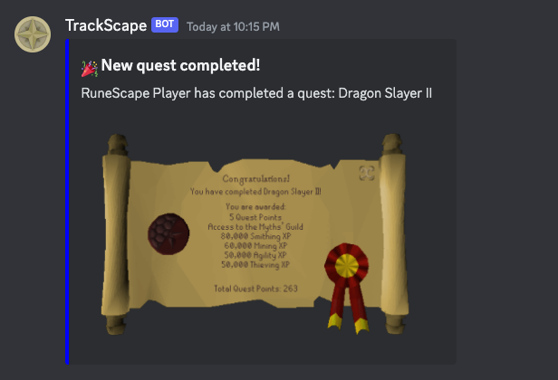

# TrackScape Discord Bot

## Features
* Receive in game Clan Chat messages in Discord via the RuneLite TrackScape Connector plugin
* Send messages to the In Game Clan Chat via Discord. This uses the RuneLite TrackScape Connector plugin to send messages to the Clan Chat.
* The bot sends embed and styled Broadcast Messages to a Discord Channel.

### Getting a chat in in game from Discord

### Clan Chat from game in Discord

***
## Commands
By default, only Discord users with Manage Server permissions can use the majorty of the commands. This can be changed via Integrations. 

> `/info` - Get information about the bot 

> `/set_broadcast_channel channel: {channel}` - Sets the to receive emded Broadcast messages

> `/set_clan_chat_channel channel: {channel}` - Sets the channel to receive Clan Chat messages and records messages sent to Clan Chat in game

> `/get_verification_code` - Get the verification code to link your RuneLite TrackScape Connector plugin to the bot

***  
## Broadcast Types

### Diary Completed 

### Item Drop

### Raid Drop

### Pet Drop

### Quest Completed

### and more!

### Setup your own bot
Coming soon! Everything needed is in the `.env` and `docker-compose.yml` files. But detailed instructions will come soon.

### Contributing
Coming soon!

## Future Features
All of the features below depends on data gotten from Clan Chat messages. So if it is not sent to the bot or does not broadcast in
CC will not be able to be sent to Discord and parsed. This is done by the RuneLite TrackScape Connector
* Get clan member activity. Check for last time xp gained or last time a chat was sent
* Pking
  - [ ] Check your K/D Pk ratio from Discord bot
  - [ ] Check your total kills and deaths from Discord bot
  - [ ] Check Gold earned and lost from Discord bot
  - [ ] In clan leaderboards
* [ ] Collection Log Leaderboards -  See where you log stands with the rest of the clan
* [ ] Bossing PB Leaderboards - See where you stand with the rest of the clan for fastest kills
* Simple Team Bingo - to be determined. May not happen
  - [ ] Bingo tiles by certain drops 
    - [ ] Bingo tiles by sets. Barrows, Godsword, etc
  - [ ] Bingo tiles by certain bosses
  - [ ] Bingo tiles by certain xp gain
  - [ ] Ability to manually check/uncheck team tiles
  - [ ] Ability to auto check tiles
  - [ ] Check your bingo card from Discord bot